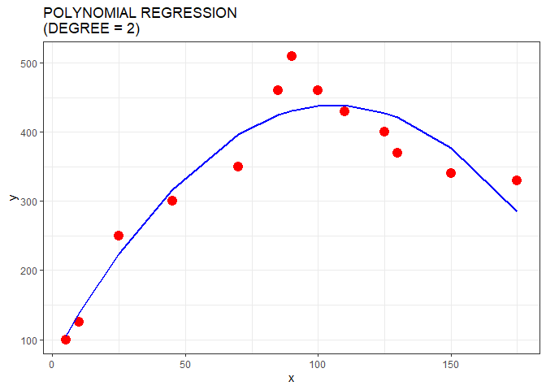

<!-- README.md is generated from README.Rmd. Please edit that file -->

# Studing regression models

<!-- badges: start -->
<!-- badges: end -->

The goal of this project is to apply some of my recent studies in
regression models. For it I simulated some regression analysis using
linear, segmented, polynomial and spline.

## Packages

``` r
library(splines)
library(tidyverse)
#> ── Attaching core tidyverse packages ─────────────────── tidyverse 1.3.2.9000 ──
#> ✔ dplyr     1.0.10     ✔ readr     2.1.3 
#> ✔ forcats   0.5.2      ✔ stringr   1.5.0 
#> ✔ ggplot2   3.4.0      ✔ tibble    3.1.8 
#> ✔ lubridate 1.9.0      ✔ tidyr     1.2.1 
#> ✔ purrr     0.3.5      
#> ── Conflicts ────────────────────────────────────────── tidyverse_conflicts() ──
#> ✖ dplyr::filter() masks stats::filter()
#> ✖ dplyr::lag()    masks stats::lag()
#> ℹ Use the ]8;;http://conflicted.r-lib.org/conflicted package]8;; to force all conflicts to become errors
library(patchwork)
library(ggthemes)
```

## Creating dataset

``` r
df <- tribble(
  ~Dias, ~Preços,
  5,100,
  10,125,
  25,250,
  45,300,
  70,350,
  85,460,
  90,510,
  100,460,
  110,430,
  125,400,
  130,370,
  150,340,
  175,330
)

head(df)
#> # A tibble: 6 × 2
#>    Dias Preços
#>   <dbl>  <dbl>
#> 1     5    100
#> 2    10    125
#> 3    25    250
#> 4    45    300
#> 5    70    350
#> 6    85    460
```

## Plot of data

``` r
g1 <-
  df |> 
  ggplot(aes(x = Dias,y = Preços)) +
  geom_point(colour = "red", size = 4) +
  labs(title = "OS DADOS - VARIAÇÃO DOS PREÇOS AO LONGO DOS DIAS") +
  theme_igray()

g1
```

<!-- -->

## Linear regression

``` r
# Linear model
m1 <- lm(Preços ~ Dias, df)
summary(m1)
#> 
#> Call:
#> lm(formula = Preços ~ Dias, data = df)
#> 
#> Residuals:
#>     Min      1Q  Median      3Q     Max 
#> -139.85  -93.42    3.01   54.87  164.01 
#> 
#> Coefficients:
#>             Estimate Std. Error t value Pr(>|t|)   
#> (Intercept) 214.8439    54.4988   3.942   0.0023 **
#> Dias          1.4572     0.5434   2.681   0.0214 * 
#> ---
#> Signif. codes:  0 '***' 0.001 '**' 0.01 '*' 0.05 '.' 0.1 ' ' 1
#> 
#> Residual standard error: 100.6 on 11 degrees of freedom
#> Multiple R-squared:  0.3953, Adjusted R-squared:  0.3403 
#> F-statistic:  7.19 on 1 and 11 DF,  p-value: 0.02135

# plot linear model
g2 <- 
  df |> 
  ggplot(aes(x = Dias,y = Preços)) +
  geom_point(colour = "red", size = 4) + 
  geom_smooth(method = "lm", color = "blue", size = 1, se = FALSE) +
  labs(title = "REGRESSÃO LINEAR") +
  theme_igray()
#> Warning: Using `size` aesthetic for lines was deprecated in ggplot2 3.4.0.
#> ℹ Please use `linewidth` instead.

g2
#> `geom_smooth()` using formula = 'y ~ x'
```

<!-- -->

## Polynomial regression (degree = 2)

``` r
# Polynomial model
m2 <- lm(Preços ~ poly(Dias,degree = 2) + Dias, df)
summary(m2)
#> 
#> Call:
#> lm(formula = Preços ~ poly(Dias, degree = 2) + Dias, data = df)
#> 
#> Residuals:
#>     Min      1Q  Median      3Q     Max 
#> -50.868 -27.769  -8.723  25.461  79.423 
#> 
#> Coefficients: (1 not defined because of singularities)
#>                         Estimate Std. Error t value Pr(>|t|)    
#> (Intercept)               340.38      11.81  28.820 5.89e-11 ***
#> poly(Dias, degree = 2)1   269.70      42.58   6.333 8.53e-05 ***
#> poly(Dias, degree = 2)2  -305.20      42.58  -7.167 3.04e-05 ***
#> Dias                          NA         NA      NA       NA    
#> ---
#> Signif. codes:  0 '***' 0.001 '**' 0.01 '*' 0.05 '.' 0.1 ' ' 1
#> 
#> Residual standard error: 42.58 on 10 degrees of freedom
#> Multiple R-squared:  0.9015, Adjusted R-squared:  0.8817 
#> F-statistic: 45.74 on 2 and 10 DF,  p-value: 9.293e-06

# Polynomial model (degree 2)
# predict
pred_m2 <- predict(m2, interval = "confidence")

# join fit and dataset 
dfm2 = cbind(df, pred_m2)
head(dfm2)
#>   Dias Preços      fit       lwr      upr
#> 1    5    100 105.8922  44.82455 166.9598
#> 2   10    125 137.9914  82.99586 192.9870
#> 3   25    250 224.5391 182.77250 266.3058
#> 4   45    300 317.1858 281.57246 352.7992
#> 5   70    350 396.4312 359.37304 433.4894
#> 6   85    460 424.4782 387.00816 461.9482

# plot
g3 <- 
  dfm2 |> 
  ggplot(aes(x = Dias, y = Preços)) +
  geom_point(colour = "red", size = 4) + 
  geom_line(aes(y = fit), color = "blue", size = 1) +
  labs(title = "REGESSÃO POLINOMIAL DE GRAU 2") +
  theme_igray()

g3
```

<!-- -->

## Segmented model

``` r
# dataet with categorical variable
dfseg <- 
  df |> 
  mutate(x = if_else(condition = Dias <= 90,true = 0,false = 1),
         dif = Dias - 90,
         X = dif * x)

# Segmetned Model
m3 <- lm(Preços ~ Dias + X, dfseg)
summary(m3)
#> 
#> Call:
#> lm(formula = Preços ~ Dias + X, data = dfseg)
#> 
#> Residuals:
#>     Min      1Q  Median      3Q     Max 
#> -42.225 -14.984  -5.498  12.875  46.956 
#> 
#> Coefficients:
#>             Estimate Std. Error t value Pr(>|t|)    
#> (Intercept)  97.9434    17.8594   5.484 0.000268 ***
#> Dias          4.2040     0.2764  15.207 3.06e-08 ***
#> X            -6.2271     0.5294 -11.763 3.52e-07 ***
#> ---
#> Signif. codes:  0 '***' 0.001 '**' 0.01 '*' 0.05 '.' 0.1 ' ' 1
#> 
#> Residual standard error: 27.39 on 10 degrees of freedom
#> Multiple R-squared:  0.9592, Adjusted R-squared:  0.9511 
#> F-statistic: 117.7 on 2 and 10 DF,  p-value: 1.125e-07

# predict
pred_m3 <- predict(m3, interval = "confidence")

# join predict with dataset 
dfm3 = cbind(df, pred_m3)
head(dfm3)
#>   Dias Preços      fit       lwr      upr
#> 1    5    100 118.9635  81.75959 156.1675
#> 2   10    125 139.9837 105.28876 174.6786
#> 3   25    250 203.0441 175.18069 230.9075
#> 4   45    300 287.1246 265.39615 308.8531
#> 5   70    350 392.2253 369.45134 414.9993
#> 6   85    460 455.2857 427.46105 483.1104

#plot
g4 <- 
  dfm3 |> 
  ggplot(aes(x = Dias, y = Preços)) +
  geom_point(colour = "red", size = 4) +
  geom_line(aes(y = fit), color = "blue", size = 1, size = 1) +
  labs(title = " REGRESSÃO SEGMENTADA (Knot = 90)") +
  theme_igray()
#> Warning: Duplicated aesthetics after name standardisation: size

g4
```

<!-- -->

## Spline Regression

``` r
# Spline Model
m4 <- lm(Preços ~ splines::bs(Dias,knots = 90),data = df)
summary(m4)
#> 
#> Call:
#> lm(formula = Preços ~ splines::bs(Dias, knots = 90), data = df)
#> 
#> Residuals:
#>     Min      1Q  Median      3Q     Max 
#> -67.049 -10.104   0.231   7.411  54.292 
#> 
#> Coefficients:
#>                                Estimate Std. Error t value Pr(>|t|)    
#> (Intercept)                      110.92      28.30   3.920  0.00442 ** 
#> splines::bs(Dias, knots = 90)1   117.52      76.30   1.540  0.16207    
#> splines::bs(Dias, knots = 90)2   546.36      70.59   7.740 5.53e-05 ***
#> splines::bs(Dias, knots = 90)3   168.90      65.68   2.572  0.03304 *  
#> splines::bs(Dias, knots = 90)4   218.64      44.29   4.936  0.00114 ** 
#> ---
#> Signif. codes:  0 '***' 0.001 '**' 0.01 '*' 0.05 '.' 0.1 ' ' 1
#> 
#> Residual standard error: 35.52 on 8 degrees of freedom
#> Multiple R-squared:  0.9452, Adjusted R-squared:  0.9177 
#> F-statistic: 34.47 on 4 and 8 DF,  p-value: 4.324e-05

# Predict
pred_m4 <- predict(m4, interval = "confidence")

# join predict with dataset
dfm4 = cbind(df, pred_m4)
head(dfm4)
#>   Dias Preços      fit       lwr      upr
#> 1    5    100 110.9248  45.66805 176.1816
#> 2   10    125 132.6080  83.20237 182.0137
#> 3   25    250 206.0837 153.15574 259.0116
#> 4   45    300 310.1035 253.39056 366.8165
#> 5   70    350 417.0486 375.98397 458.1133
#> 6   85    460 451.4096 410.54148 492.2777

# plot
g5 <- 
  dfm4 |> 
  ggplot(aes(x = Dias, y = Preços)) +
  geom_point(colour = "red", size = 4) +
  geom_line(aes(y = fit), color = "blue", size = 1, size = 1) +
  labs(title = "REGRESSÃO SPLINE (Knot = 90)") +
  theme_igray()
#> Warning: Duplicated aesthetics after name standardisation: size

g5
```

<!-- -->

# WHAT IS THE BETTER?

``` r
g1 / (g2 | g3) / (g4 | g5)
#> `geom_smooth()` using formula = 'y ~ x'
```

<!-- -->

### Reference

[Spline Regression in
R](https://medium.com/analytics-vidhya/spline-regression-in-r-960ca82aa62c)
