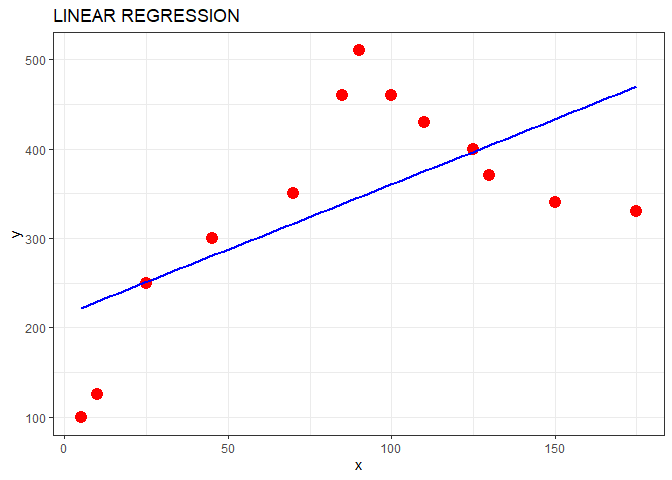
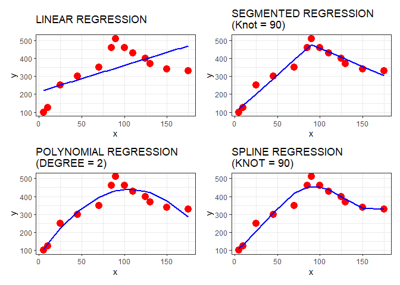

<!-- README.md is generated from README.Rmd. Please edit that file -->

# Regression models for quantitative outcomes

<!-- badges: start -->
<!-- badges: end -->

It is not uncommon situations in which we want to predict something. For
issues in which we want to predict quantitative outcomes such as the
price of a house in a specific area, which media are associated with
sales, if is there a relationship between advertising budget and sales
or the price of product, regression models may a useful tool to make
this forecast task.

There are distinct regression models:

- **Linear**;

- **Segmented**;

- **Spline** and;

- **Polynomial**.

Let’s see the main characteristics of these models;

# Linear Regression model

The most common regression model is **Linear model**. Linear regression
models are widely used in various fields such as statistics,
econometrics, social sciences, business, and machine learning, so on. It
is a very simple statistical method, but a useful tool for predicting a
quantitative outcome. A linear regression model is commonly used to
model the relationship between two or more variables by fitting a linear
equation to observed data.

Mathematically, we can write this linear relationship as:

$$
y = \beta_0 + \beta_1 X + \epsilon
$$

Where,

y = outcome;

$\beta_0$ = intercept (constant);

$\beta_1$ = Slope;

$X$ = Predictor (it is possible to have $n$ predictors);

$\epsilon$ = error

The goal of linear regression is to estimate the values of the
regression coefficients ($\beta_0, \beta_1...\beta_n$) that best fit the
observed data, typically using a method called least squares estimation.
Once the regression coefficients are estimated, the linear regression
model can be used to make predictions of the dependent variable based on
the values of the independent variables.

# Segmented Regression model

A segmented regression model, also known as a piecewise regression model
or a broken-stick regression model, is a type of regression model that
allows for different linear relationships between variables in different
segments or intervals of the data. It is used when there is evidence to
suggest that the relationship between variables changes at specific
points or breakpoints in the data.

A segmented regression model typically involves fitting different linear
regression equations to different segments of the data, separated by
breakpoints. The breakpoints represent the points at which the
relationship between the variables changes. The segmented regression
model can have one or more breakpoints, depending on the complexity of
the relationship being modeled.

The equation for a segmented linear regression model can be represented
mathematically as follows:

- In segment 1 (for values of the independent variable $X$ less than the
  first breakpoint $X_1$);

$$
y = \beta_0 + \beta_1 X + \epsilon
$$

- In the segment 2 (for values of $X$ greater than or equal to $X_1$ and
  less than second breackpoint $X_2$);

$$
y = \beta_0 + \beta_1 X_1 + \beta_2(X - X_2) + \epsilon
$$ - In the segment 3 (for values of $X$ greater than or equal to $X_2$
and less than second breackpoint $X_3$);

$$
y = \beta_0 + \beta_1 X_1 + \beta_2(X_2 - X_1) + \beta_3(X - X_1) + \epsilon
$$ And so on, for each segment of the data with corresponding
breakpoints $X_1$,$X_2$,$X_3$,…, regression coefficients
$\beta_1$,$\beta_2$,$\beta_3$…, and erro terms
$\epsilon_1$,$\epsilon_2$,$\epsilon_3$,…

The number of segments and breakpoints in a segmented linear regression
model depends on the specific data and context of the analysis, and can
be determined based on prior knowledge or through statistical methods,
such as change-point detection techniques.

# Polynomial Regression model

Polynomial regression is used to model the relationship between a
predictor variable and a response variable using a polynomial function
of a certain degree, rather than a straight line as in simple linear
regression.

The equation for polynomial regression can be expressed as:

$$
y = \beta_0 + \beta_1X + \beta_2X^2 + \beta_3X^3 + ... + \beta_nX^n + \epsilon
$$

Polynomial regression can be used to model various types of
relationships between variables, including linear relationships (when
the degree is 1), quadratic relationships (when the degree is 2), and
higher-order relationships (when the degree is greater than 2).
Polynomial regression can capture both upward and downward curvatures in
the data, making it a flexible modeling technique for a wide range of
data patterns.

# Spline Regression model

Similar to polynomial regression, Regression splines are also useful to
capture nonlinear relationships between variables. They are a flexible
and powerful method for fitting smooth curves to data that do not follow
a linear pattern.

A regression spline works by dividing the range of a predictor variable
(independent variable) into multiple segments or intervals, and then
fitting a separate piecewise function or curve to each segment. These
piecewise functions are typically polynomials of a low degree (e.g.,
linear or quadratic) within each segment, and they are joined together
at specific points called knots. The knots are chosen in such a way that
they allow for smooth transitions between the segments, resulting in a
smooth overall curve.

There are various types of regression splines, such as natural splines,
cubic splines, and B-splines, each with its own properties and
characteristics.

A cubic spline with K knots can be modeled as:

$$
y = \beta_0 + \beta_1 b_1 (X) + \beta_2(X_2 - X_1) + \beta_3(X - X_1) + \epsilon_2
$$

As above mentioned, one of the advantages of using regression splines is
that they can capture both linear and nonlinear patterns in the data, as
the curves within each segment can have different shapes. This makes
them more flexible than traditional linear regression, which assumes a
constant relationship between variables.

# WHAT IS THE BETTER?

Unfortunately (or fortunately), **there is no WINNER when comparing
regression models!**. All are useful and can be used for different
issues and, therefore we should analyze the issue that we need to solve
and choose the more appropriate regression model for those issues.

# WARNING

This content is related to my studies in statistics and, thus it is not
an academic reference. Please, more detailed information can be checked
in the reference listed below.

### Reference

\-[Spline Regression in
R](https://medium.com/analytics-vidhya/spline-regression-in-r-960ca82aa62c)

\-[Estimating regression models with unknown
break-points](https://onlinelibrary.wiley.com/doi/10.1002/sim.1545)

\-[An Introduction to
StatisticalLearning](https://www.statlearning.com/)
